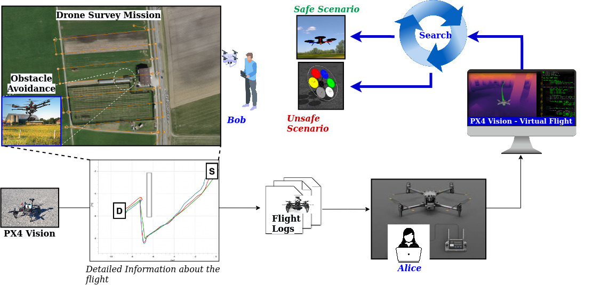

# SURREALIST: Simulation-based Test Case Generation for UAVs in the Neighborhood of Real Flights

Simulation-based testing represents a fundamental testing practice for Unmanned aerial vehicles (UAVs), but the testing scenarios considered in software-in-the-loop testing may not be representative of the actual scenarios experienced in the field.
Here, we propose Surrealist (teSting Uavs in the neighboRhood of REAl fLIghtS), a novel search-based approach that analyses logs of real UAV flights and automatically generates simulation-based tests in the neighborhood of such real flights, thereby improving the realism and representativeness of the simulation-based tests.
This is done in two steps: first, Surrealist faithfully replicates the given UAV flight in the simulation environment, generating a simulation-based test that mirrors a pre-logged real-world behavior. Then, it smoothly manipulates the replicated flight conditions to discover slightly modified flight scenarios that are challenging or trigger misbehaviors of the UAV under test in simulation.

Surrealist internally uses [Aerialist](https://github.com/skhatiri/Aerialist), A UAV test bench developed on top of PX4, to evalute the UAV test cases in the simulation environment.

## Method Overview

The de-facto standard testing process of UAVs relies on manually-written system-level tests for testing UAVs in the field.
These tests are defined as specific **software configurations** in a given **simulated/physical environment** and a set of **runtime commands** that make the UAV fly with a specific **observable behavior** (e.g., flight trajectory, speed, distance to obstacles).
We model a UAV simulated test case with the following test properties:

- UAV Configuration: [Autopilot parameters](https://docs.px4.io/main/en/advanced_config/parameter_reference.html) set at startup, configuration files (e.g., mission plan) required, etc.
- Environment Configuration: Simulation settings such as simulation world (e.g., surface material, UAV’s initial position), surrounding objects (e.g., obstacles size, position), weather condition (e.g., wind, lighting), etc.
- Runtime Commands: Timestamped external commands sent from GCS or RC to the UAV during the flight (e.g., changing the flight mode, flying in a specific direction, starting autonomous flight)

Since the physical attributes of the simulated and real UAVs and the surrounding environments are often not identical, simply replaying the same set of commands sent to a physical UAV (as recorded in the logs) would not always result in the same observable behavior in simulators. For instance, sending a command for going forward with full power for 1 second, will likely not bring the real and simulated UAVs to have the same speed and acceleration, and to cover the same distance. This is typically due to the differences in UAV real vs simulated characteristics (e.g., weight, motors power, and sensors accuracy) and to unpredictable environmental factors (e.g., wind and other disturbances).

Given a field test log, SURREALIST aims to generate simulated test cases that replicate, as closely as possible, real-world observations (e.g., flight trajectory). This is done by finding the best combination of the above-mentioned test properties, so as to minimize some distance measure between the sensor readings of the field test and its simulated counterpart (e.g., the Euclidean distance between the two flight trajectories).
Starting from this replicated simulation test, SURREALIST generates variants in the close neighborhood of the test case, with the goal of creating potentially more challenging scenarios. This is achieved by updating the test properties, with the purpose of increasing the complexity (or risk level) of the generated test cases. The test complexity is measured  according to a given fitness function, e.g., the minimum distance of the UAV to the obstacles during the flight. To achieve these goals, we propose a generic search-based approach that generates simulation-based test cases that minimize a given distance measure (or maximize a given fitness function) by iteratively manipulating the corresponding test properties



## Setup

### Local Development Environment

The toolkit requires python >= 3.8 and has been tested with PX4 development environment on ubuntu 18.04 and 20.04

1. Clone this repository and cd into its root directory
2. `pip3 install -r requiremetns.txt`
3. Create a file named .env in the repository's root directory. Then copy and customize contents of [template.env](template.env) into it.

### Using Docker

You can use the dockerfile to build a Docker image with all the requirements.

1. `docker build . -t surrealist`
2. `docker run -it surrealist bash`

You can now execute all the commands in the containers bash.

**Note:** Your user should be able to run docker commands without sudo. [check here](https://docs.docker.com/engine/install/linux-postinstall/)
**Note:** The .env for the docker image come from [template.env](template.env). You can customize them using environment variables for the Docker container.

## Command-Line Interface

You can utilize the toolkit with following command line options:

**Note:** Before running any command, make sure you are at the root directory of the repository:

`cd Surrealist/`

You can use `python3 surrealist --help` anywhere to get help on the command parameters.

|argument   | input type            | description                   |
|-----------|-----------------------|------------------------------ |
| --seed    | path/to/file.yml      | seed test description yaml file|
| --budget  | int = 10              | global budget of the search algorithm|
| --mission | path/to/file.plan     | input mission file address    |
| --params  | path/to/file.csv      | params file address           |
| --simulator| {**gazebo**,jmavsim,ros} | the simulator environment to run|
| --obstacle| float [l,w,h,x,y,z,r] | obstacle size, position, and angle to put in simulation environment|
| --obstacle2| float [l,w,h,x,y,z,r]| obstacle size, position, and angle to put in simulation environment|  
| --commands| path/to/file.{ulg,csv}| runtime commands file address |
| --log     | path/to/file.ulg      | reference log file address    |
| -n        | int = 1               | no. of parallel runs          |
| --path    | path/to/folder/       | cloud output path to copy logs|
| --id      | string                | experiment Id                 |

Some of the common combination of the following arguments are listed here as sample test cases:

- Replicating an autonomous flight in simulation, by finding optimal obstacle properties (box size, position, orientation):

`python3 surrealist  obstacle --id case0 --obstacle 3 3 3 -7.56 4.54 0 158.8  -n 5 --budget 100 --path https://filer.cloudlab.zhaw.ch/remote.php/webdav/ICST/ --mission experiments/case0.plan --log experiments/case0.ulg --params experiments/case0-params.csv --commands experiments/case0-commands.csv  --simulator ros`

- Generating challenging tests for autonomous flight in simulation, by finding optimal additional obstacle properties (box size, position, orientation):

`python3 surrealist  obstacle2 --id case0 --obstacle 3 3 3 -7.56 4.54 0 158.8 -obstacle2 3 3 3 -7.56 24.54 0 158.8 -n 5 --budget 100 --path https://filer.cloudlab.zhaw.ch/remote.php/webdav/ICST/ --mission experiments/case0.plan --log experiments/case0.ulg --params experiments/case0-params.csv --commands experiments/case0-commands.csv  --simulator ros`

## References

If you use this tool in your research, please cite the following papers:

- **Sajad Khatiri**, Sebastiano Panichella, and Paolo Tonella, "Simulation-based Test Case Generation for Unmanned Aerial Vehicles in the Neighborhood of Real Flights," *In 2023 IEEE 16th International Conference on Software Testing, Verification and Validation (ICST)*
  - [Preprint](https://skhatiri.ir/papers/surreal.pdf)

````{code-block} bibtex
@inproceedings{khatiri2023simulation,
  title={Simulation-based test case generation for unmanned aerial vehicles in the neighborhood of real flights},
  author={Khatiri, Sajad and Panichella, Sebastiano and Tonella, Paolo},
  booktitle={2023 16th IEEE International Conference on Software Testing, Verification and Validation (ICST)},
  year={2023},
}
````

## License

The software we developed is distributed under MIT license. See the [license](./LICENSE.md) file.

## Contacts

- Sajad Khatiri
  - Zurich University of Applied Science (ZHAW), Switzerland - mazr@zhaw.ch
